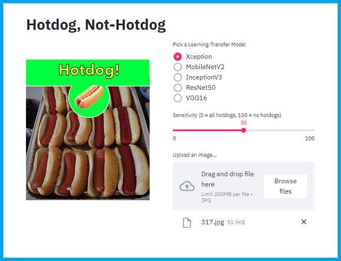

# Hotdog Not Hotdog

__[Try out the App!](https://share.streamlit.io/ccaldarella99/hotdog_not_hotdog/main/hotdog.py)__

Inspired by the HBO Series, Silicon Valley, this is a re-creation of Jian-Yang's infamous __*Hotdog/Not-Hotdog*__ App. This app uses a convolutional neural net (CNN) that can run a prediction on whether a picture contains an image of a hotdog or not. 

(App is rendered using Streamlit so a user can upload a picture and have the model run a prediction.)

## Data 
Data is a set of train and test images of classes __Hotdog__ and __Not-Hotdog__ from [this Kaggle competition](https://www.kaggle.com/yashvrdnjain/hotdognothotdog#__sid=js0).

 
<strong>Monica:</strong> "That's it? It only does hot dogs?"
 
<strong>Jian-Yang:</strong> "No, and not hot dog."

## About the App

Using Transfer Learning, I was able to create five different Convolutional Neural Nets. THe app allows you to pick which Neural Net you want to use:

 - Xception
 - MobileNetV2
 - InceptionV3
 - ResNet50
 - VGG16

There is also a Slider bar that allows you to alter the sensitivity of the Model.

## Conclusion

The Xception, MobileNetV2, and InceptionV3 models actually performed very similarly wit haround 90% Accuracy, precision and Recall. The VGG16 model did not do as well, but still pretty well at around 82%. However, the ResNet50 model did not do well at all, unable to break 50% (see table below).

| Model       | Validation Accuracy | Validation Precision | Validation Recall |
| ----------- | ------------------- | -------------------- | ----------------- |
| Xception    | 0.9363 | 0.9363 | 0.9363 |
| MobileNetV2 | 0.9068 | 0.9068 | 0.9068 |
| InceptionV3 | 0.9286 | 0.9286 | 0.9286 |
| ResNet50    | 0.5000 | 0.5000 | 0.5000 |
| VGG16       | 0.8261 | 0.8261 | 0.8261 |

I would conclude that the Xception model generally performed best, but not much different than the MobileNetV2 and the InceptionV3 Models. Any of these would be a good choice to use with this Application. I would not use the other two since they performed poorly, and both were also quite slow.

